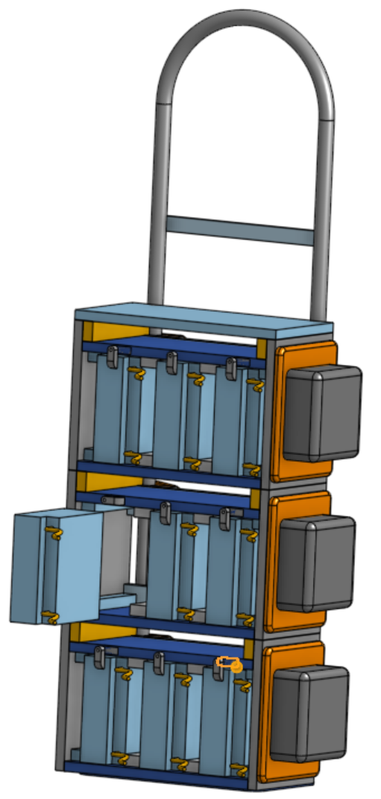
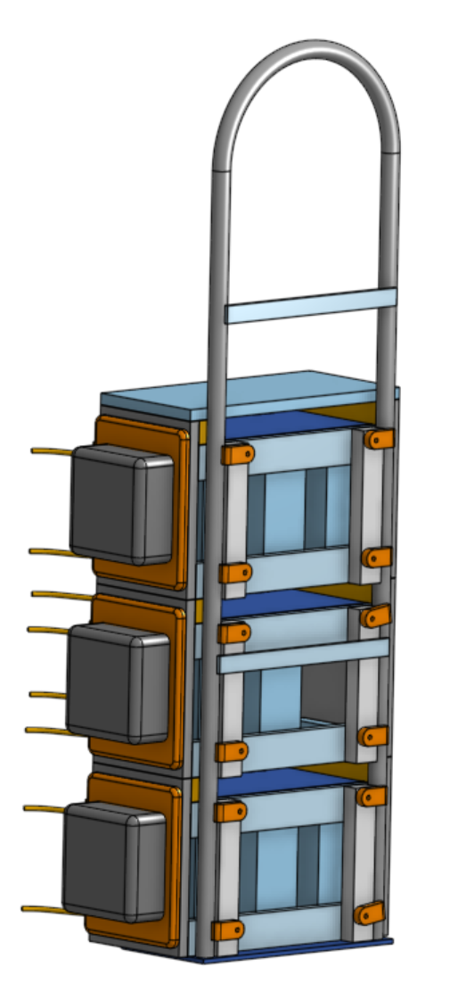

# FRC Battery Cart Plans

 

 - Costs less than $200 (not including batteries and chargers).
 - Made from wood and hand truck.
 - Takes 6 hours to build.
 - Has modular battery boxes that each hold three batteries (9 batteries total.)
 - Battery boxes each independently attach to and detach from the hand truck without tools.
 - Designed for easy cable management with plenty of room between batteries, an open back, and small shelves to coil extra cords.
 - Easy to modify to attach to different hand trucks.
 - Weighs about 170 pounds fully loaded (130 pounds of that is batteries and chargers)
 - Can be safely maneuvered by medium sized team members (100+ pounds.)

----------------------------

## Get started: [Shopping List](shopping.md)

 

 - [Overview](README.md)
 - [Shopping List](shopping.md)
 - [Cut List](cut.md)
 - [Assembly Instructions](instructions.md)