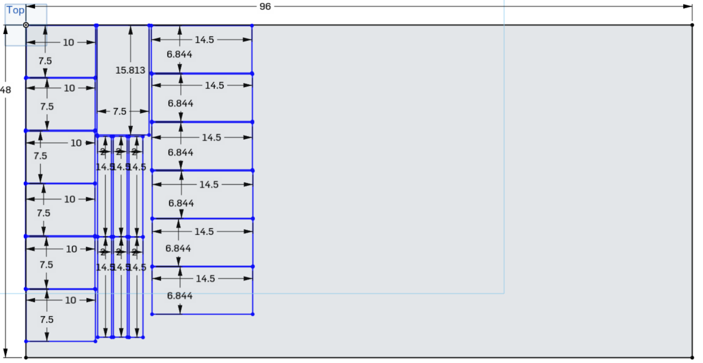

# FRC Battery Cart Wood cut list

### Conversions

 - .125 is 1/8
 - .375 is 3/8
 - .438 is 7/16
 - .5 is 1/2
 - .625 is 5/8
 - .75 is 3/4
 - .813 is 13/16
 - .844 is 27/32 (almost 7/8)

### Plywood

 - Six 7.5x10" -- sides
 - Six 6.844x14.5" -- bottoms/shelves
 - One 7.5x15.813" -- top
 - Six 2x14.5" -- backs

### 2x4

 - Six 1x8.625" -- hand truck mounting blocks (1" matches the width of the hand truck tubing, adjust if needed)
 - Twelve 0.75x6" -- battery spacers

### 1x4

 - Six 1.375x7.5" -- shelf spacers
 - Twelve 1x6" -- battery side spacers
 - Twelve 1x2" -- Swivel locks

### Out of scraps

 - Nine 0.5x0.75x1.5" -- Swivel locks

----------------------------

## Next: [Assembly Instructions](instructions.md)

 - [Overview](README.md)
 - [3D Model in Onshape CAD](https://cad.onshape.com/documents/e27376a00e2bee291e4c527a/w/01df19b2e8fa2ee681f6dbda/e/62a35a5563f0918d1d084148)
 - [Shopping List](shopping.md)
 - [Cut List](cut.md)
 - [Assembly Instructions](instructions.md)
