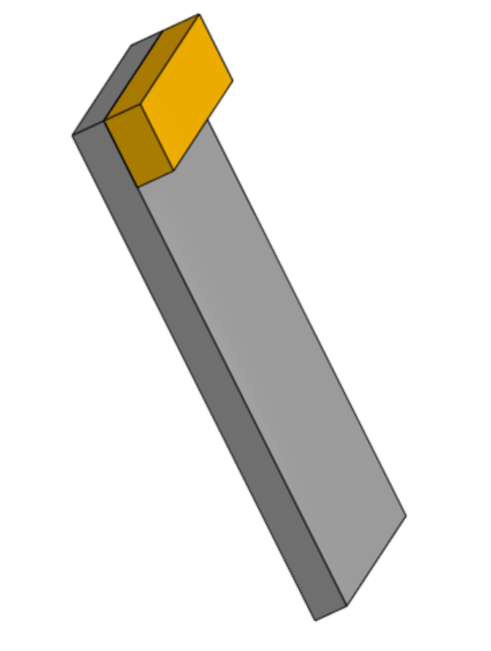
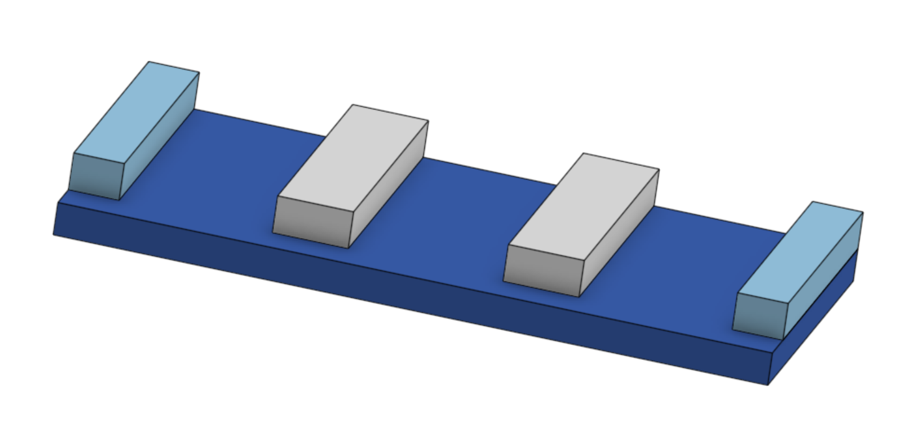
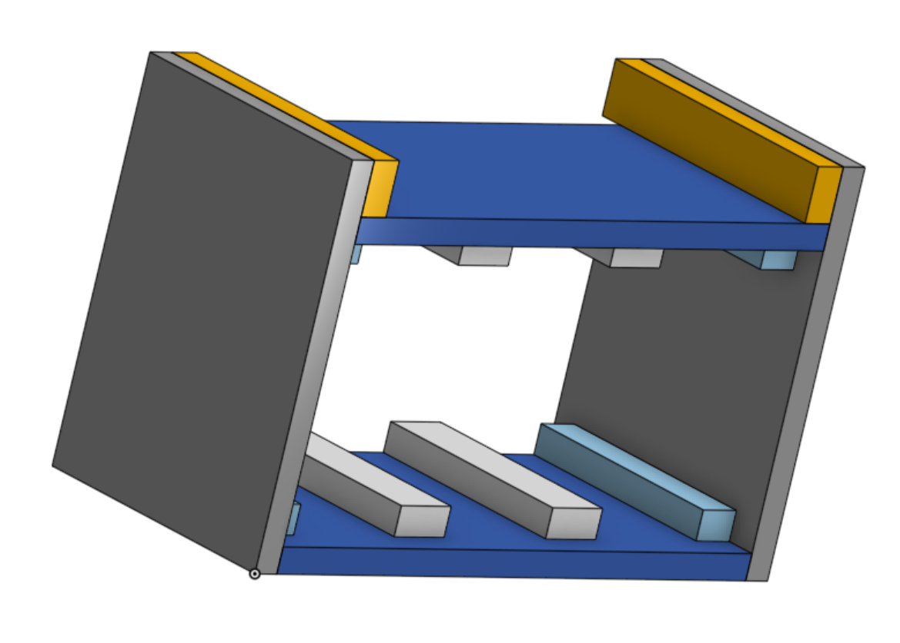
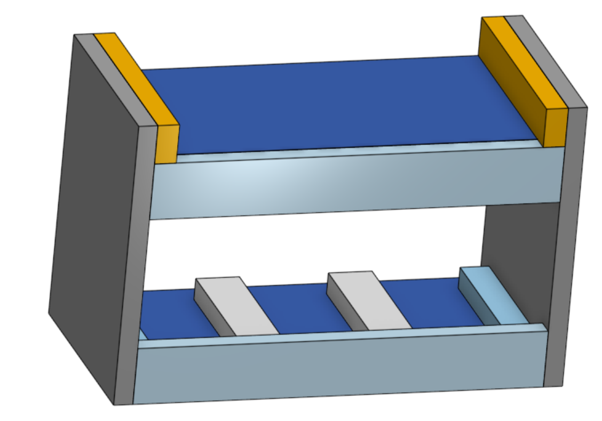
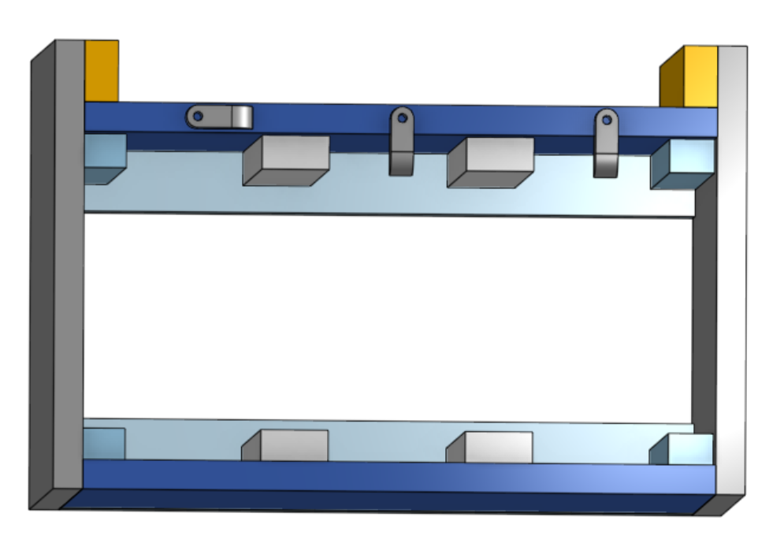
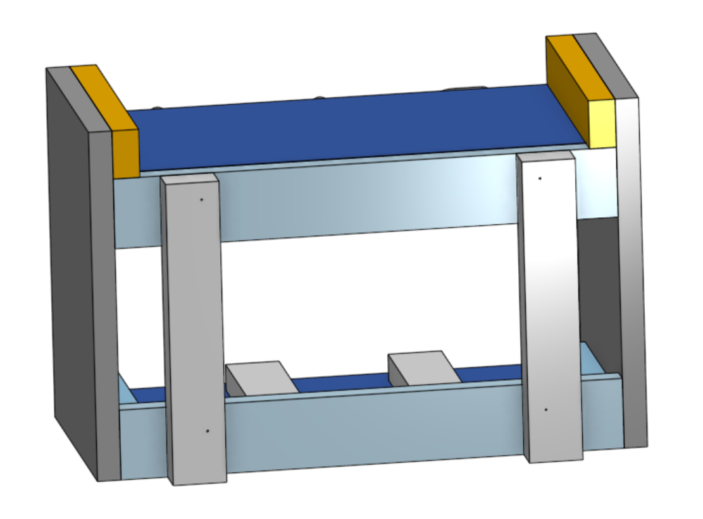
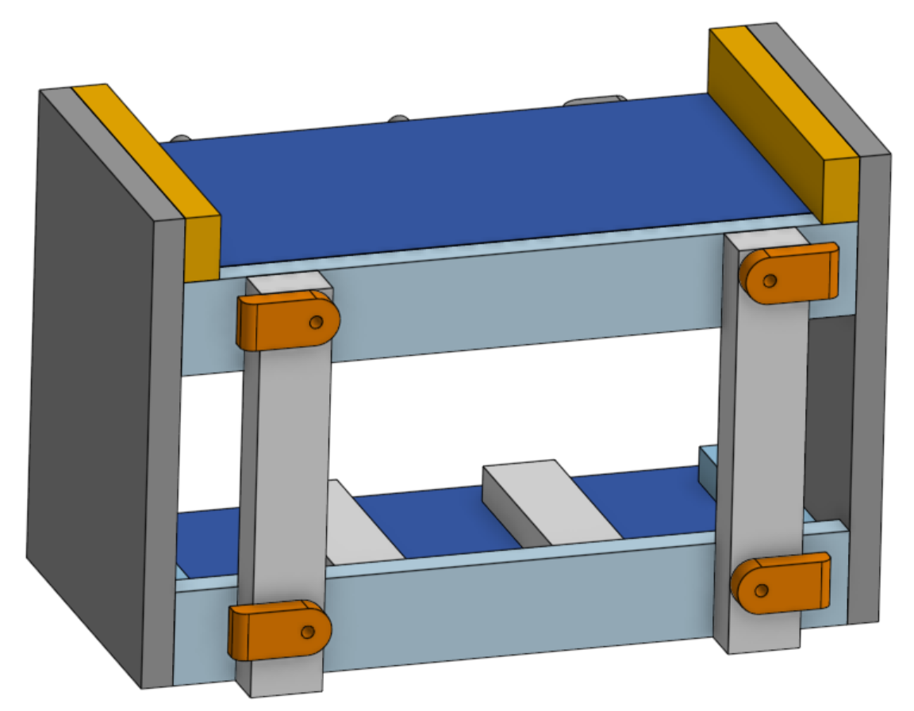

# FRC Battery Cart Assembly Instructions

## Step 1 -- Side assembly

 - Six 7.5x10" -- sides
 - Six 1.375x7.5" -- shelf spacers

 1. Glue and nail the shelf spacers to the top of the sides.

## Step 2 -- Bottom assembly

 - Six 6.844x14.125" -- bottoms/shelvesspacers
 - Twelve 1x6" -- battery side spacers
 - Twelve 1.5x6" -- battery spacers

 1. Glue and nail the battery side spaces to the ends of the bottoms.
 2. Place a battery next to the side spacer and mark its outer edge. (Batteries are 3" wide if you don't have one handy.)
 3. Give the battery 1/16 to 1/8" of breathing room and mount the larger spaces using glue and nails. Ensure that a battery will able slide in each of the three channels with a small amount of wiggle room.

 Note: The rails are all pushed to the back to allow extra room for battery wires in the front.

## Step 3 -- Box assembly

 1. Glue and nail the boxes together as shown. The sides and bottom should align the FRONT. The battery spacers align in the BACK.

## Step 4 -- Box back

 - Six 2x14.125" -- backs

 1. Glue and nail backs onto the boxes

## Step 5 -- Battery latches

 - Nine 0.5x0.75x1.5" -- Swivel locks

 1. Sand the swivel locks into shape.
 2. Drill 1/4 holes in the round end (a hole bigger than the screw).
 3. Drill 1/8 pilot holes into the shelf edge above each battery (a hole smaller than the screw).
 4. Attach the swivel locks with pan head screws and washers.
 5. Tighten the screws so that the swivel locks can be operated by hand.

## Step 6 -- Hand truck mounting rails

 - Six 1x8.625" -- hand truck mounting blocks 

 1. Space the mounting blocks apart so that they just fit between the uprights on the hand truck (11.5" in our case, but adjust as necessary.)
 2. Screw them into place using wood screws (or glue and nail them if you don't want to have the flexibility to adapt them to a different hand truck later.)

## Step 5 -- Hand truck latches

 - Twelve 1x2" -- Swivel locks

 1. Sand the swivel locks into shape.
 2. Drill 1/4 holes in the round end (a hole bigger than the screw).
 3. Figure out a vertical mounting point that won't hit parts of your hand truck.
 3. Drill 1/8 pilot holes into mounting blocks (a hole smaller than the screw).
 4. Attach the swivel locks with pan head screws and washers.
 5. Tighten the screws so that the swivel locks can be operated by hand.

## Step 6 -- Top

 - 7.5x15.438" -- top

 1. Glue and nail the top onto one of the boxes

## Step 7 -- Stack the boxes

 1. Stack the boxes on the hand truck (the box with the top shelf goes on the top of the stack).
 2. Lock them into place by spinning the latches on the back.

## Step 8 -- Mount the chargers

 1. Mount the chargers on the side.
 2. Neatly stow the cables on the shelves

----------------------------

 - [Overview](README.md)
 - [3D Model in Onshape CAD](https://cad.onshape.com/documents/e27376a00e2bee291e4c527a/w/01df19b2e8fa2ee681f6dbda/e/62a35a5563f0918d1d084148)
 - [Shopping List](shopping.md)
 - [Cut List](cut.md)
 - [Assembly Instructions](instructions.md)